# Documentacion del API - IOT Server

Este documento contiene la documentacion tecnica completa de los modulos **Auth**, **Administrators** y **Users** del servidor IoT, incluyendo endpoints, diagramas de flujo, modelos de datos y descripcion de tests.

## Indice

1. [Arquitectura General](#arquitectura-general)
2. [Modelo de Datos](#modelo-de-datos)
3. [Middleware de Autenticacion](#middleware-de-autenticacion)
4. [Modulo Auth](#modulo-auth)
5. [Modulo Administrators](#modulo-administrators)
6. [Modulo Users](#modulo-users)
7. [Tests](#tests)

---

## Arquitectura General

El proyecto sigue una arquitectura en capas con el patron **Repository-Service-Controller**:

```
Controller (endpoints HTTP)
    |
Service (logica de negocio)
    |
Repository (acceso a datos)
    |
Database (SQLite via SQLModel)
```

### Diagrama de Componentes

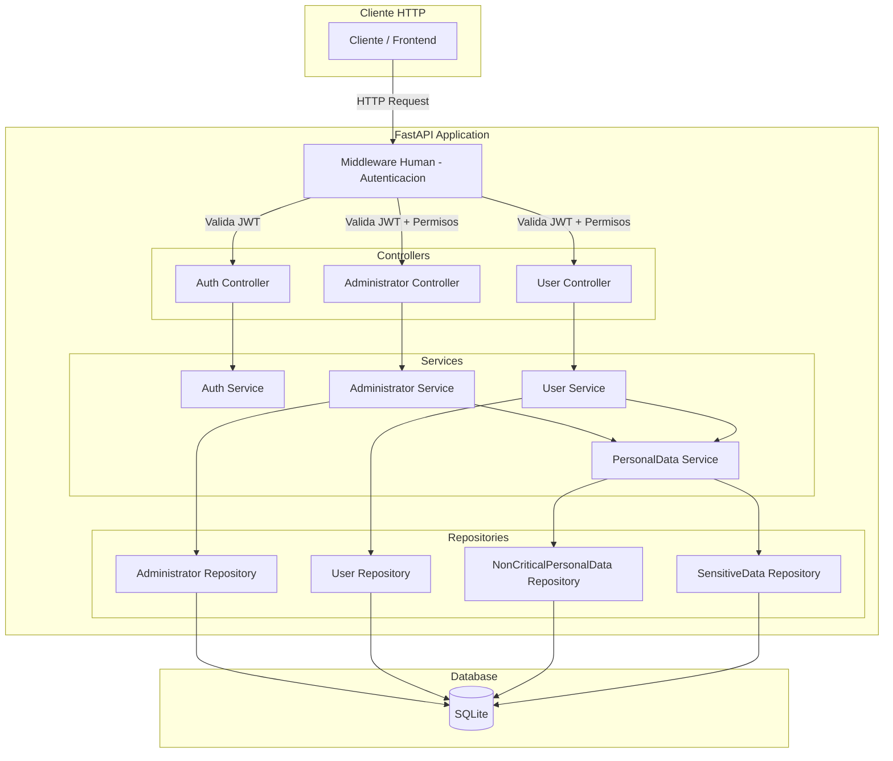

---

## Modelo de Datos

### Diagrama Entidad-Relacion

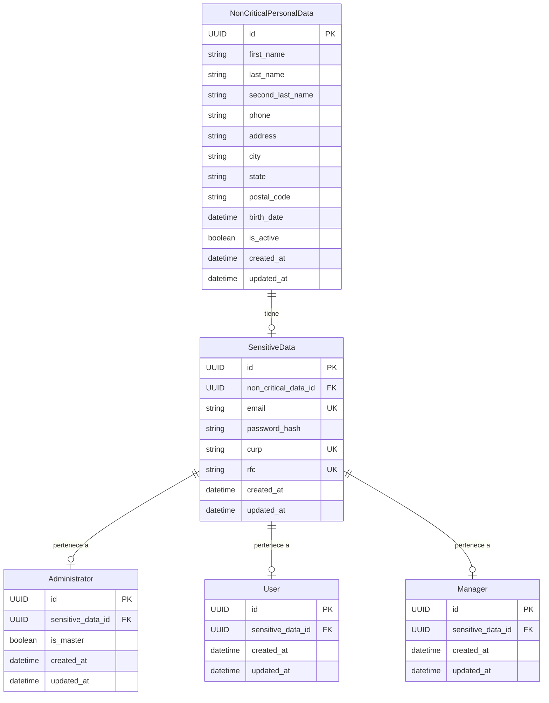

### Descripcion de Tablas

| Tabla | Descripcion |
|-------|-------------|
| `NonCriticalPersonalData` | Datos personales no sensibles (nombre, telefono, direccion, etc.) |
| `SensitiveData` | Datos sensibles (email, password hash, CURP, RFC). Vincula datos personales con el tipo de cuenta |
| `Administrator` | Cuenta de administrador. Puede ser `is_master=True` para privilegios completos |
| `User` | Cuenta de usuario regular del sistema |
| `Manager` | Cuenta de gestor/manager con permisos intermedios |

### Relacion entre Tablas (Creacion de Cuenta)

Al crear cualquier tipo de cuenta (Administrator, User, Manager), se crean **3 registros**:

1. `NonCriticalPersonalData` - datos personales basicos
2. `SensitiveData` - email, password hash, CURP, RFC (vinculado a NonCriticalPersonalData)
3. `Administrator` / `User` / `Manager` - registro del tipo de cuenta (vinculado a SensitiveData)

---

## Middleware de Autenticacion

### Clase `Human` (Middleware)

**Ubicacion:** `app/shared/middleware/auth/human.py`

Este middleware intercepta **todas las peticiones HTTP** y realiza la autenticacion basada en JWT.

#### Rutas Publicas (sin autenticacion)

| Ruta | Descripcion |
|------|-------------|
| `/docs` | Documentacion Swagger UI |
| `/openapi.json` | Esquema OpenAPI |
| `/redoc` | Documentacion ReDoc |
| `/api/v1/auth/login` | Endpoint de login |

#### Diagrama de Flujo - Middleware de Autenticacion

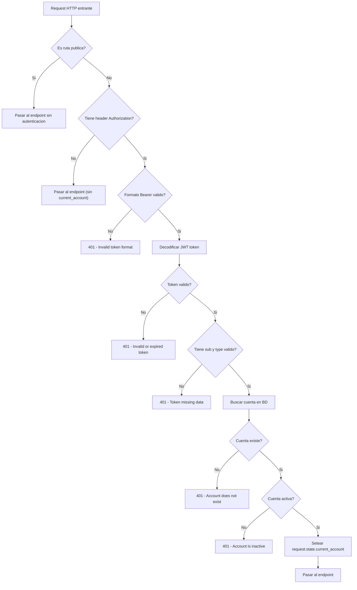

#### Niveles de Autorizacion

El sistema implementa 4 niveles de autorizacion a traves de dependencias FastAPI:

| Funcion | Descripcion | Tipos permitidos |
|---------|-------------|-----------------|
| `require_authenticated` | Cualquier usuario autenticado | administrator, manager, user |
| `require_admin` | Solo administradores | administrator |
| `require_master_admin` | Solo administradores master | administrator (is_master=True) |
| `require_admin_or_manager` | Administradores o managers | administrator, manager |

---

## Modulo Auth

**Prefijo base:** `/api/v1/auth`  
**Tags:** `Auth`  
**Ubicacion:** `app/domain/auth/`

### Endpoints

#### 1. POST `/api/v1/auth/login`

**Descripcion:** Autentica un usuario y retorna un token JWT.

| Campo | Detalle |
|-------|---------|
| **Metodo** | `POST` |
| **Autenticacion** | No requerida (ruta publica) |
| **Request Body** | `LoginRequest` |
| **Response** | `TokenResponse` |
| **Codigos de respuesta** | 200 (exito), 400 (credenciales invalidas / cuenta inactiva), 422 (validacion) |

**Request Body (`LoginRequest`):**

```json
{
    "email": "admin@iot.com",
    "password": "Admin1234!"
}
```

| Campo | Tipo | Validacion |
|-------|------|------------|
| `email` | string | min 6 chars, max 254, debe contener `@`, no empezar/terminar con `@`, se normaliza a minusculas y se recorta |
| `password` | string | min 8 chars, max 128 |

**Response (`TokenResponse`):**

```json
{
    "access_token": "eyJhbGciOiJIUzI1NiIs...",
    "token_type": "bearer",
    "account_type": "administrator",
    "is_master": true
}
```

#### Diagrama de Flujo - Login

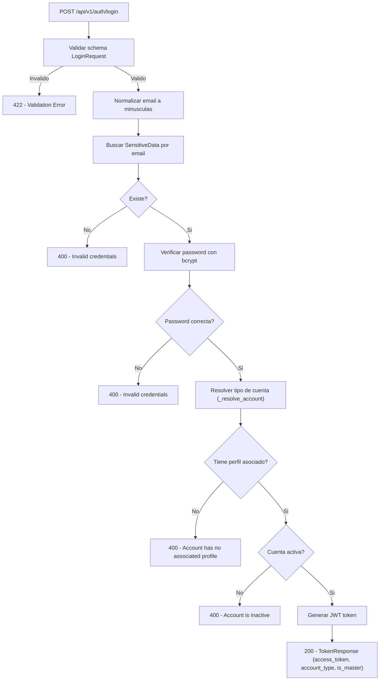

#### Contenido del JWT Token

```json
{
    "sub": "uuid-de-la-cuenta",
    "email": "admin@iot.com",
    "type": "administrator",
    "is_master": true,
    "exp": 1700000000
}
```

| Campo | Descripcion |
|-------|-------------|
| `sub` | UUID de la cuenta (Administrator/Manager/User) |
| `email` | Email del usuario |
| `type` | Tipo de cuenta: `administrator`, `manager`, `user` |
| `is_master` | Si es administrador master |
| `exp` | Timestamp de expiracion (configurable, default 60 min) |

---

#### 2. PATCH `/api/v1/auth/change-password`

**Descripcion:** Permite al usuario autenticado cambiar su contrasena.

| Campo | Detalle |
|-------|---------|
| **Metodo** | `PATCH` |
| **Autenticacion** | Requerida (cualquier usuario autenticado) |
| **Request Body** | `ChangePasswordRequest` |
| **Response** | `MessageResponse` |
| **Codigos de respuesta** | 200 (exito), 400 (password actual incorrecta), 401 (no autenticado / token invalido), 422 (validacion) |

**Request Body (`ChangePasswordRequest`):**

```json
{
    "current_password": "MiPasswordActual123!",
    "new_password": "MiNuevaPassword456!"
}
```

| Campo | Tipo | Validacion |
|-------|------|------------|
| `current_password` | string | min 8 chars, max 128 |
| `new_password` | string | min 8 chars, max 128 |

**Response (`MessageResponse`):**

```json
{
    "message": "Password updated successfully"
}
```

#### Diagrama de Flujo - Cambio de Contrasena

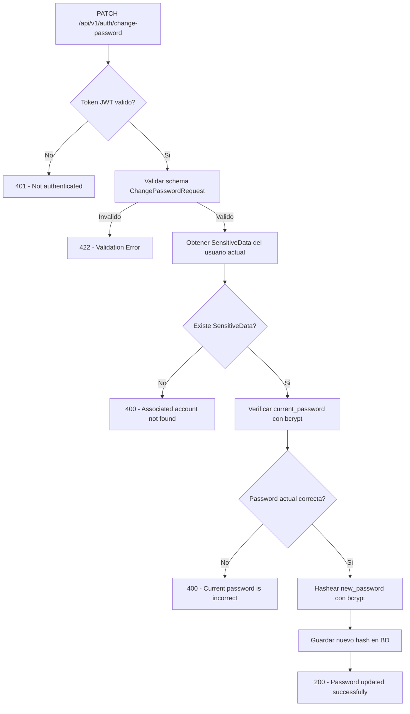

### Seguridad (security.py)

| Funcion | Descripcion |
|---------|-------------|
| `verify_password(plain, hash)` | Verifica password con `bcrypt.checkpw` |
| `get_password_hash(password)` | Genera hash con `bcrypt.hashpw` + `bcrypt.gensalt()` |
| `create_access_token(data)` | Crea JWT con `PyJWT`, algoritmo HS256, expiracion configurable |
| `decode_access_token(token)` | Decodifica y valida JWT. Lanza 401 si invalido/expirado |

---

## Modulo Administrators

**Prefijo base:** `/api/v1/administrators`  
**Tags:** `Administrators`  
**Ubicacion:** `app/domain/administrator/`

### Control de Acceso

**Todos los endpoints** de este modulo requieren **privilegios de Master Administrator** (`require_master_admin`).

| Rol | Acceso |
|-----|--------|
| Master Administrator | Permitido |
| Regular Administrator | Denegado (403) |
| Manager | Denegado (403) |
| User | Denegado (403) |
| Sin autenticacion | Denegado (401) |

### Endpoints

#### 1. GET `/api/v1/administrators`

**Descripcion:** Lista todos los administradores con paginacion.

| Campo | Detalle |
|-------|---------|
| **Metodo** | `GET` |
| **Autenticacion** | Master Admin requerido |
| **Query Params** | `offset` (default 0), `limit` (default 20, max 100) |
| **Response** | `PageResponse[AdministratorResponse]` |
| **Codigos** | 200, 401, 403 |

**Response:**

```json
{
    "total": 5,
    "offset": 0,
    "limit": 20,
    "data": [
        {
            "id": "uuid",
            "first_name": "Admin",
            "last_name": "Master",
            "second_last_name": "Test",
            "is_active": true,
            "created_at": "2025-01-01T00:00:00",
            "updated_at": "2025-01-01T00:00:00"
        }
    ]
}
```

---

#### 2. GET `/api/v1/administrators/{resource_id}`

**Descripcion:** Obtiene un administrador por su UUID.

| Campo | Detalle |
|-------|---------|
| **Metodo** | `GET` |
| **Autenticacion** | Master Admin requerido |
| **Path Param** | `resource_id` (UUID) |
| **Response** | `AdministratorResponse` |
| **Codigos** | 200, 401, 403, 404, 422 |

---

#### 3. POST `/api/v1/administrators`

**Descripcion:** Crea un nuevo administrador.

| Campo | Detalle |
|-------|---------|
| **Metodo** | `POST` |
| **Autenticacion** | Master Admin requerido |
| **Request Body** | `PersonalDataCreate` |
| **Response** | `AdministratorResponse` |
| **Codigos** | 201, 401, 403, 422, 500 (duplicado) |

**Request Body (`PersonalDataCreate`):**

```json
{
    "first_name": "Nuevo",
    "last_name": "Admin",
    "second_last_name": "Test",
    "phone": "+523312345700",
    "address": "123 Calle Principal",
    "city": "Ciudad de Mexico",
    "state": "Mexico",
    "postal_code": "06500",
    "birth_date": "1990-06-15T00:00:00",
    "email": "nuevo_admin@test.com",
    "password_hash": "SecurePass123!",
    "curp": "ABCD123456HDFRRL09",
    "rfc": "ABCD123456AB0"
}
```

| Campo | Tipo | Validacion |
|-------|------|------------|
| `first_name` | string | min 2, max 60 |
| `last_name` | string | min 2, max 60 |
| `second_last_name` | string | min 2, max 60 |
| `phone` | string | patron `^\+?[0-9]{10,15}$` |
| `address` | string | min 5, max 150 |
| `city` | string | min 2, max 80 |
| `state` | string | min 2, max 80 |
| `postal_code` | string | patron `^[0-9]{5}$` |
| `birth_date` | datetime | No puede ser fecha futura |
| `email` | string | min 6, max 254, formato email valido |
| `password_hash` | string | min 8, max 128 (se hashea automaticamente) |
| `curp` | string | patron `^[A-Z0-9]{18}$` |
| `rfc` | string | patron `^[A-Z0-9]{12,13}$` |

#### Diagrama de Flujo - Crear Administrador

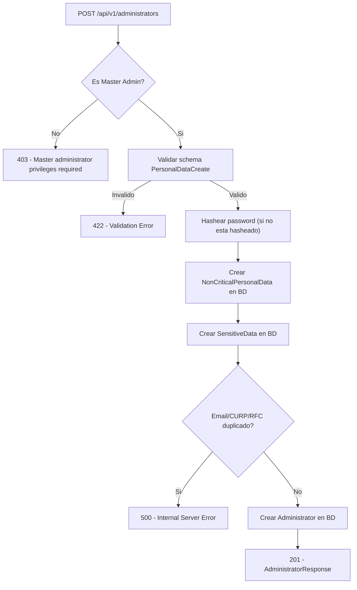

---

#### 4. PATCH `/api/v1/administrators/{resource_id}`

**Descripcion:** Actualiza parcialmente un administrador.

| Campo | Detalle |
|-------|---------|
| **Metodo** | `PATCH` |
| **Autenticacion** | Master Admin requerido |
| **Path Param** | `resource_id` (UUID) |
| **Request Body** | `PersonalDataUpdate` (campos opcionales) |
| **Response** | `AdministratorResponse` |
| **Codigos** | 200, 401, 403, 404, 422 |

**Request Body (`PersonalDataUpdate` - todos opcionales):**

```json
{
    "first_name": "NuevoNombre",
    "is_active": false
}
```

#### Diagrama de Flujo - Actualizar Administrador

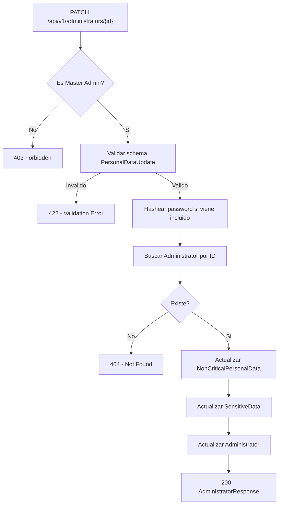

---

#### 5. DELETE `/api/v1/administrators/{resource_id}`

**Descripcion:** Elimina un administrador y sus datos asociados (cascada).

| Campo | Detalle |
|-------|---------|
| **Metodo** | `DELETE` |
| **Autenticacion** | Master Admin requerido |
| **Path Param** | `resource_id` (UUID) |
| **Response** | Sin contenido |
| **Codigos** | 204, 401, 403, 404 |

#### Diagrama de Flujo - Eliminar Administrador

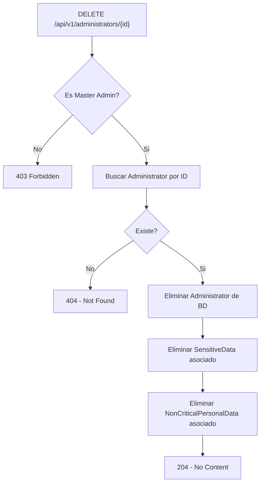

---

## Modulo Users

**Prefijo base:** `/api/v1/users`  
**Tags:** `Users`  
**Ubicacion:** `app/domain/user/`

### Control de Acceso

| Operacion | Rol Requerido | Funcion de autorizacion |
|-----------|--------------|------------------------|
| Listar (GET /) | Admin o Manager | `require_admin_or_manager` |
| Obtener (GET /{id}) | Admin o Manager | `require_admin_or_manager` |
| Crear (POST /) | Admin | `require_admin` |
| Actualizar (PATCH /{id}) | Admin | `require_admin` |
| Eliminar (DELETE /{id}) | Admin | `require_admin` |

### Permisos por Rol

| Rol | Listar | Obtener | Crear | Actualizar | Eliminar |
|-----|--------|---------|-------|------------|----------|
| Master Admin | Permitido | Permitido | Permitido | Permitido | Permitido |
| Regular Admin | Permitido | Permitido | Permitido | Permitido | Permitido |
| Manager | Permitido | Permitido | Denegado (403) | Denegado (403) | Denegado (403) |
| User | Denegado (403) | Denegado (403) | Denegado (403) | Denegado (403) | Denegado (403) |
| Sin autenticacion | Denegado (401) | Denegado (401) | Denegado (401) | Denegado (401) | Denegado (401) |

### Endpoints

#### 1. GET `/api/v1/users`

**Descripcion:** Lista todos los usuarios con paginacion.

| Campo | Detalle |
|-------|---------|
| **Metodo** | `GET` |
| **Autenticacion** | Admin o Manager requerido |
| **Query Params** | `offset` (default 0), `limit` (default 20, max 100) |
| **Response** | `PageResponse[UserResponse]` |
| **Codigos** | 200, 401, 403 |

---

#### 2. GET `/api/v1/users/{resource_id}`

**Descripcion:** Obtiene un usuario por su UUID.

| Campo | Detalle |
|-------|---------|
| **Metodo** | `GET` |
| **Autenticacion** | Admin o Manager requerido |
| **Path Param** | `resource_id` (UUID) |
| **Response** | `UserResponse` |
| **Codigos** | 200, 401, 403, 404, 422 |

---

#### 3. POST `/api/v1/users`

**Descripcion:** Crea un nuevo usuario.

| Campo | Detalle |
|-------|---------|
| **Metodo** | `POST` |
| **Autenticacion** | Admin requerido |
| **Request Body** | `PersonalDataCreate` |
| **Response** | `UserResponse` |
| **Codigos** | 201, 401, 403, 422, 500 (duplicado) |

El body de creacion es identico al de Administrators (ver seccion de Administrators).

#### Diagrama de Flujo - Crear Usuario

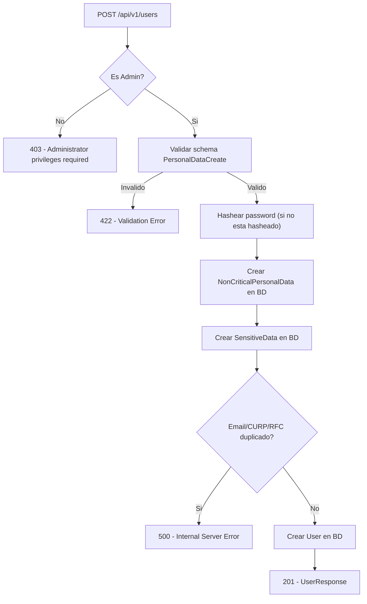

---

#### 4. PATCH `/api/v1/users/{resource_id}`

**Descripcion:** Actualiza parcialmente un usuario.

| Campo | Detalle |
|-------|---------|
| **Metodo** | `PATCH` |
| **Autenticacion** | Admin requerido |
| **Path Param** | `resource_id` (UUID) |
| **Request Body** | `PersonalDataUpdate` (campos opcionales) |
| **Response** | `UserResponse` |
| **Codigos** | 200, 401, 403, 404, 422 |

---

#### 5. DELETE `/api/v1/users/{resource_id}`

**Descripcion:** Elimina un usuario y sus datos asociados (cascada).

| Campo | Detalle |
|-------|---------|
| **Metodo** | `DELETE` |
| **Autenticacion** | Admin requerido |
| **Path Param** | `resource_id` (UUID) |
| **Response** | Sin contenido |
| **Codigos** | 204, 401, 403, 404 |

#### Diagrama de Flujo - Eliminar Usuario

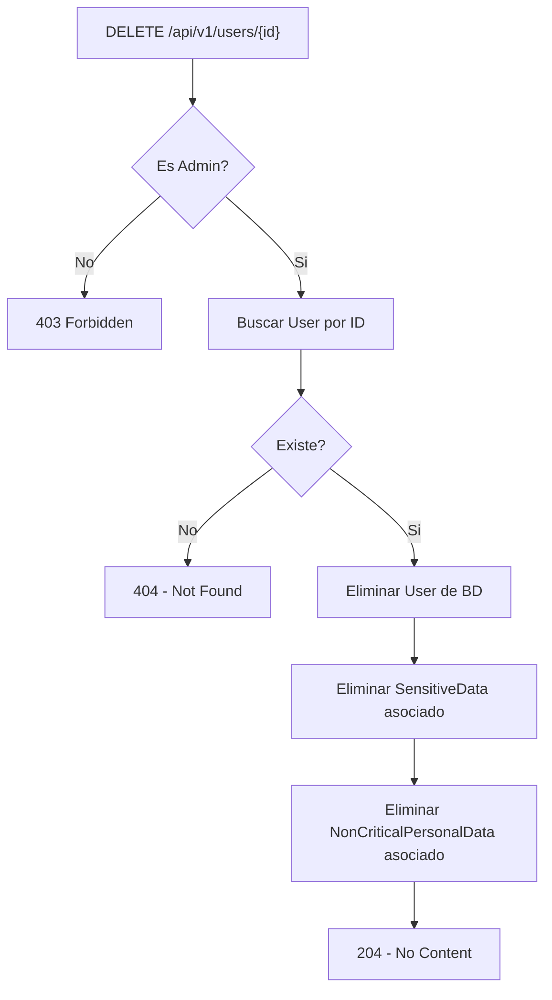

---

## Tests

### Configuracion de Tests (`tests/conftest.py`)

Los tests utilizan:

- **Base de datos temporal:** SQLite en archivo temporal, creado y destruido por cada test
- **Fixtures de cuentas:** Se crean cuentas de prueba para cada rol (master admin, regular admin, user, manager, inactive user)
- **Override de dependencias:** Se sobrescribe la sesion de BD y el engine del middleware para usar la BD de prueba
- **Secret Key de prueba:** Se usa una clave JWT de al menos 32 bytes para evitar warnings de seguridad

#### Fixtures Disponibles

| Fixture | Descripcion | Email | Password |
|---------|-------------|-------|----------|
| `master_admin_account` | Admin master con todos los privilegios | `master_admin@test.com` | `MasterPassword123!` |
| `regular_admin_account` | Admin regular (sin privilegios master) | `regular_admin@test.com` | `RegularAdmin123!` |
| `user_account` | Usuario regular | `user@test.com` | `UserPassword123!` |
| `manager_account` | Manager | `manager@test.com` | `ManagerPass123!` |
| `inactive_user_account` | Usuario inactivo | `inactive@test.com` | `InactivePass123!` |

---

### Tests del Modulo Auth

**Ubicacion:** `tests/auth/`

#### test_login.py - Tests de Login (15 tests)

| # | Test | Descripcion | Resultado Esperado |
|---|------|-------------|-------------------|
| 1 | `test_login_successful_master_admin` | Login exitoso con credenciales de master admin | 200, token valido, `account_type=administrator`, `is_master=True` |
| 2 | `test_login_successful_regular_admin` | Login exitoso con admin regular | 200, `account_type=administrator`, `is_master=False` |
| 3 | `test_login_successful_user` | Login exitoso con usuario regular | 200, `account_type=user`, `is_master=False` |
| 4 | `test_login_successful_manager` | Login exitoso con manager | 200, `account_type=manager`, `is_master=False` |
| 5 | `test_login_email_not_found` | Login con email inexistente | 400, "Invalid credentials" |
| 6 | `test_login_wrong_password` | Login con password incorrecta | 400, "Invalid credentials" |
| 7 | `test_login_inactive_account` | Login con cuenta inactiva | 400, "inactive" |
| 8 | `test_login_email_too_short` | Email menor a 6 caracteres | 422 |
| 9 | `test_login_email_without_at_symbol` | Email sin `@` | 422 |
| 10 | `test_login_email_starting_with_at` | Email empieza con `@` | 422 |
| 11 | `test_login_email_ending_with_at` | Email termina con `@` | 422 |
| 12 | `test_login_password_too_short` | Password menor a 8 caracteres | 422 |
| 13 | `test_login_extra_fields_rejected` | Campos extra en request | 422 |
| 14 | `test_login_email_normalized` | Email en mayusculas se normaliza | 200 |
| 15 | `test_login_email_trimmed` | Email con espacios se recorta | 200 |

#### Diagrama de Cobertura - Login Tests

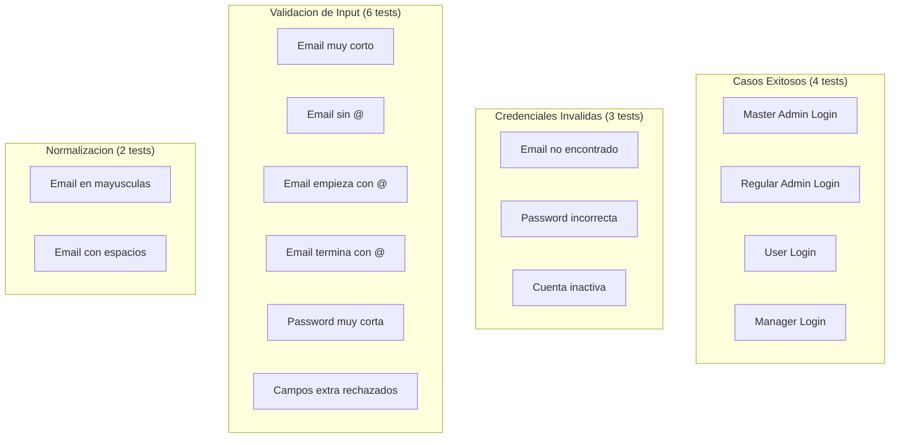

---

#### test_change_password.py - Tests de Cambio de Contrasena (10 tests)

| # | Test | Descripcion | Resultado Esperado |
|---|------|-------------|-------------------|
| 1 | `test_change_password_successful` | Cambio exitoso para master admin | 200, "updated" |
| 2 | `test_change_password_wrong_current_password` | Password actual incorrecta | 400, "current password" |
| 3 | `test_change_password_without_token` | Sin token de autenticacion | 401 |
| 4 | `test_change_password_with_invalid_token` | Token JWT invalido | 401 |
| 5 | `test_change_password_new_too_short` | Nueva password muy corta | 422 |
| 6 | `test_change_password_current_too_short` | Password actual muy corta | 422 |
| 7 | `test_change_password_extra_fields_rejected` | Campos extra en request | 422 |
| 8 | `test_change_password_user_account` | Cambio exitoso para usuario | 200 |
| 9 | `test_change_password_manager_account` | Cambio exitoso para manager | 200 |
| 10 | `test_change_password_inactive_user_is_blocked` | Usuario inactivo bloqueado por middleware | 401 |

---

### Tests del Modulo Administrators

**Ubicacion:** `tests/administrator/test_crud.py`

#### TestAdministratorList - Tests de Listado (6 tests)

| # | Test | Descripcion | Resultado Esperado |
|---|------|-------------|-------------------|
| 1 | `test_list_administrators_as_master_admin` | Listar como master admin | 200, con `total` y `data` |
| 2 | `test_list_administrators_as_regular_admin` | Listar como admin regular | 403 |
| 3 | `test_list_administrators_as_user` | Listar como usuario | 403 |
| 4 | `test_list_administrators_as_manager` | Listar como manager | 403 |
| 5 | `test_list_administrators_without_token` | Listar sin autenticacion | 401 |
| 6 | `test_list_administrators_pagination` | Paginacion con offset y limit | 200, `limit=10`, `offset=0` |

#### TestAdministratorRetrieve - Tests de Consulta Individual (4 tests)

| # | Test | Descripcion | Resultado Esperado |
|---|------|-------------|-------------------|
| 1 | `test_retrieve_administrator_as_master_admin` | Obtener como master admin | 200, datos correctos |
| 2 | `test_retrieve_administrator_not_found` | UUID inexistente | 404 |
| 3 | `test_retrieve_administrator_invalid_uuid` | UUID invalido | 422 |
| 4 | `test_retrieve_administrator_as_regular_admin_forbidden` | Obtener como admin regular | 403 |

#### TestAdministratorCreate - Tests de Creacion (10 tests)

| # | Test | Descripcion | Resultado Esperado |
|---|------|-------------|-------------------|
| 1 | `test_create_administrator_as_master_admin` | Crear como master admin | 201, datos correctos |
| 2 | `test_create_administrator_duplicate_email` | Email duplicado | 500 |
| 3 | `test_create_administrator_missing_required_field` | Campo requerido faltante | 422 |
| 4 | `test_create_administrator_invalid_phone` | Formato de telefono invalido | 422 |
| 5 | `test_create_administrator_invalid_postal_code` | Codigo postal invalido | 422 |
| 6 | `test_create_administrator_invalid_curp` | CURP invalido | 422 |
| 7 | `test_create_administrator_invalid_rfc` | RFC invalido | 422 |
| 8 | `test_create_administrator_future_birth_date` | Fecha de nacimiento futura | 422 |
| 9 | `test_create_administrator_as_regular_admin_forbidden` | Crear como admin regular | 403 |
| 10 | `test_create_administrator_as_user_forbidden` | Crear como usuario | 403 |

#### TestAdministratorUpdate - Tests de Actualizacion (6 tests)

| # | Test | Descripcion | Resultado Esperado |
|---|------|-------------|-------------------|
| 1 | `test_update_administrator_partial` | Actualizacion parcial (solo first_name) | 200, campo actualizado |
| 2 | `test_update_administrator_full` | Actualizacion de multiples campos | 200, campos actualizados |
| 3 | `test_update_administrator_deactivate` | Desactivar administrador | 200, `is_active=False` |
| 4 | `test_update_administrator_not_found` | UUID inexistente | 404 |
| 5 | `test_update_administrator_invalid_email` | Email invalido | 422 |
| 6 | `test_update_administrator_as_regular_admin_forbidden` | Actualizar como admin regular | 403 |

#### TestAdministratorDelete - Tests de Eliminacion (6 tests)

| # | Test | Descripcion | Resultado Esperado |
|---|------|-------------|-------------------|
| 1 | `test_delete_administrator_returns_204` | Eliminacion exitosa | 204 |
| 2 | `test_delete_administrator_is_gone_after_deletion` | Verificar que no existe despues de eliminar | GET retorna 404 |
| 3 | `test_delete_administrator_cascades_related_records` | Eliminacion en cascada (Admin + SensitiveData + NonCriticalPersonalData) | Todos los registros eliminados |
| 4 | `test_delete_administrator_not_found` | UUID inexistente | 404 |
| 5 | `test_delete_administrator_as_regular_admin_forbidden` | Eliminar como admin regular | 403 |
| 6 | `test_delete_administrator_as_user_forbidden` | Eliminar como usuario | 403 |

---

### Tests del Modulo Users

**Ubicacion:** `tests/user/test_crud.py`

#### TestUserList - Tests de Listado (5 tests)

| # | Test | Descripcion | Resultado Esperado |
|---|------|-------------|-------------------|
| 1 | `test_list_users_as_admin` | Listar como admin | 200, con `total` y `data` |
| 2 | `test_list_users_as_manager` | Listar como manager | 200 |
| 3 | `test_list_users_as_user_forbidden` | Listar como usuario | 403 |
| 4 | `test_list_users_without_token` | Sin autenticacion | 401 |
| 5 | `test_list_users_pagination` | Paginacion | 200, `limit=10`, `offset=0` |

#### TestUserRetrieve - Tests de Consulta Individual (5 tests)

| # | Test | Descripcion | Resultado Esperado |
|---|------|-------------|-------------------|
| 1 | `test_retrieve_user_as_admin` | Obtener como admin | 200, datos correctos |
| 2 | `test_retrieve_user_as_manager` | Obtener como manager | 200 |
| 3 | `test_retrieve_user_not_found` | UUID inexistente | 404 |
| 4 | `test_retrieve_user_invalid_uuid` | UUID invalido | 422 |
| 5 | `test_retrieve_user_as_user_forbidden` | Obtener como usuario | 403 |

#### TestUserCreate - Tests de Creacion (10 tests)

| # | Test | Descripcion | Resultado Esperado |
|---|------|-------------|-------------------|
| 1 | `test_create_user_as_admin` | Crear como admin | 201, datos correctos |
| 2 | `test_create_user_as_manager_forbidden` | Crear como manager | 403 |
| 3 | `test_create_user_duplicate_email` | Email duplicado | 500 |
| 4 | `test_create_user_missing_required_field` | Campo requerido faltante | 422 |
| 5 | `test_create_user_invalid_phone` | Telefono invalido | 422 |
| 6 | `test_create_user_invalid_postal_code` | Codigo postal invalido | 422 |
| 7 | `test_create_user_invalid_curp` | CURP invalido | 422 |
| 8 | `test_create_user_invalid_rfc` | RFC invalido | 422 |
| 9 | `test_create_user_future_birth_date` | Fecha futura | 422 |
| 10 | `test_create_user_as_user_forbidden` | Crear como usuario | 403 |

#### TestUserUpdate - Tests de Actualizacion (7 tests)

| # | Test | Descripcion | Resultado Esperado |
|---|------|-------------|-------------------|
| 1 | `test_update_user_full` | Actualizacion completa | 200 |
| 2 | `test_update_user_partial` | Actualizacion parcial | 200 |
| 3 | `test_update_user_not_found` | UUID inexistente | 404 |
| 4 | `test_update_user_invalid_email` | Email invalido | 422 |
| 5 | `test_update_user_deactivate` | Desactivar usuario | 200 |
| 6 | `test_update_user_as_manager_forbidden` | Actualizar como manager | 403 |
| 7 | `test_update_user_as_user_forbidden` | Actualizar como usuario | 403 |

#### TestUserDelete - Tests de Eliminacion (4 tests)

| # | Test | Descripcion | Resultado Esperado |
|---|------|-------------|-------------------|
| 1 | `test_delete_user_as_admin` | Eliminacion exitosa con cascada | 204 |
| 2 | `test_delete_user_not_found` | UUID inexistente | 404 |
| 3 | `test_delete_user_as_manager_forbidden` | Eliminar como manager | 403 |
| 4 | `test_delete_user_as_user_forbidden` | Eliminar como usuario | 403 |

---

### Resumen de Tests

| Modulo | Archivo | Cantidad de Tests |
|--------|---------|-------------------|
| Auth - Login | `tests/auth/test_login.py` | 15 |
| Auth - Change Password | `tests/auth/test_change_password.py` | 10 |
| Administrators - CRUD | `tests/administrator/test_crud.py` | 32 |
| Users - CRUD | `tests/user/test_crud.py` | 31 |
| **Total** | | **88** |

### Diagrama General de Cobertura de Tests

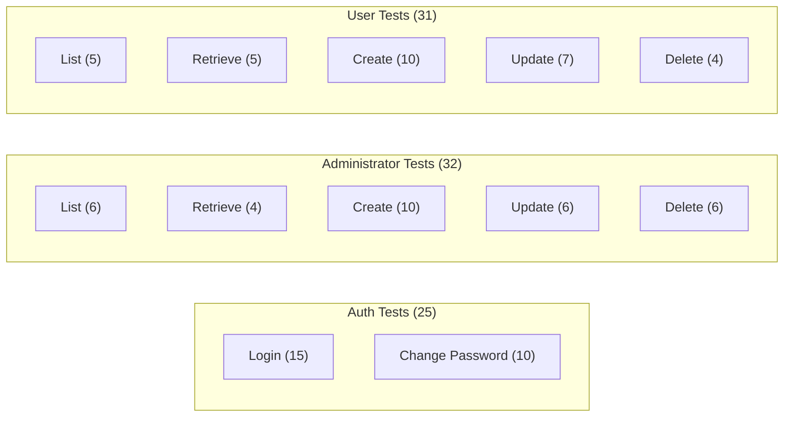

### Como Ejecutar los Tests

```bash
# Instalar dependencias
uv sync

# Ejecutar todos los tests
DATABASE_URL="sqlite:///test.db" uv run pytest tests/ -v

# Ejecutar tests de un modulo especifico
DATABASE_URL="sqlite:///test.db" uv run pytest tests/auth/ -v
DATABASE_URL="sqlite:///test.db" uv run pytest tests/administrator/ -v
DATABASE_URL="sqlite:///test.db" uv run pytest tests/user/ -v

# Ejecutar un test especifico
DATABASE_URL="sqlite:///test.db" uv run pytest tests/auth/test_login.py::TestLogin::test_login_successful_master_admin -v
```
